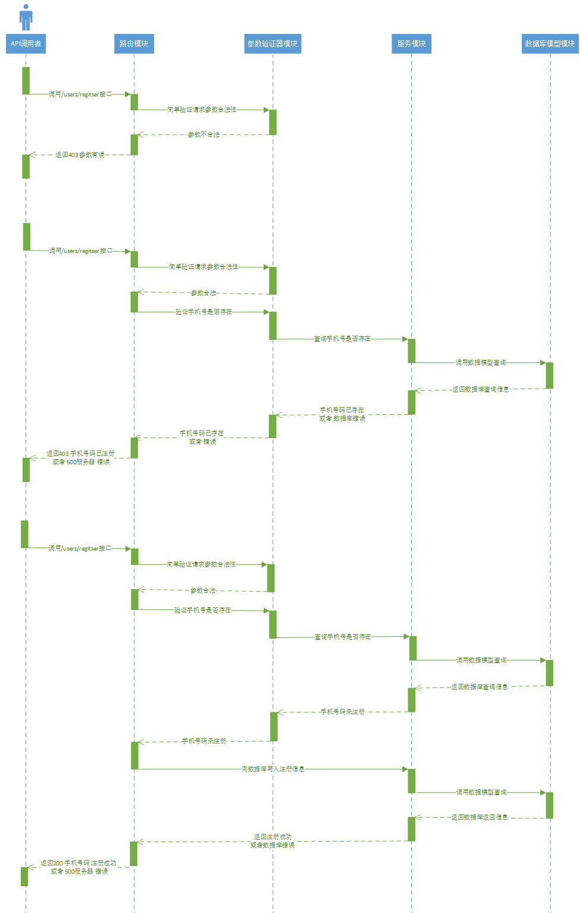

# 开发步骤

## 1、安装 koa 框架

```bash
npm i koa
```

## 2、编写最基本的app

```javascript
---src
	---main.js
	核心代码:
    const Koa = require('koa');
    const app = new Koa();

    app.use((ctx, next) => {
        ctx.body = "hello world"
    })
    
    app.listen(3000, () => {
        console.log("服务已经启动 http://127.0.0.1:3000");
    })
```

## 3、读取配置文件

### 3.1、安装 dotenv

```bash
npm i dotenv
```

### 3.2、创建 .env 文件 并编写配置文件

```
---.env
    APP_PORT=3000
```

### 3.3、创建 config.default.js 读取配置文件并暴露

```javascript
---src
	---config
		---config.default.js
		核心代码:
		
		const dotenv = require('dotenv')
		dotenv.config()
		// console.log(process.env.APP_PORT)
		module.exports = process.env
```

### 3.4、入口文件读取 配置文件信息

```javascript
---src
	---main.js
	核心代码:
	const Koa = require('koa');
	//读取配置文件
	const { APP_PORT } = require('./config/config.default')
	const app = new Koa();
	app.use((ctx, next) => {
    	ctx.body = "hello world"
	})
	//使用配置文件的信息
	app.listen(APP_PORT, () => {
   	 	console.log(`服务已经启动 http://127.0.0.1:${APP_PORT}`);
	})
```

## 4、koa-router的使用

### 4.1、安装 dotenv

```bash
npm i koa-router
```

### 4.2、简单的使用测试

```javascript
---main.js
	核心代码
	const Router = require('koa-router')
	const IndexRouter = new Router()
	IndexRouter.get('/', (ctx, next) => {
    	ctx.body = "hello index"
	})
	app.use(IndexRouter.routes())
```

## 5、创建一个user.route的router

```javascript
---src
	---router
		---user.route.js
		核心代码:
		const Router = require('koa-router')
		//添加前缀
		const UserRouter = new Router({ prefix: '/users' })
		UserRouter.get('/', (ctx, next) => {
            ctx.body = "hello users"
		})
		module.exports = UserRouter
```

## 6、main.js 使用user.router

```javascript
---src
	---main.js
	核心代码：
    const UserRouter = require('./router/user.route')
	app.use(UserRouter.routes())
```

## 7、优化目录结构:将mian.js里面的涉及koa的业务都封装到app里面

```bash
---src
	---app
		---index.js
		核心代码:
		const Koa = require('koa');
		const app = new Koa();
		const UserRouter = require('../router/user.route')
		app.use(UserRouter.routes())
		module.exports = app
---src
	---main.js
		核心代码:
		const { APP_PORT } = require('./config/config.default')
		const app = require('./app')
		app.listen(APP_PORT, () => {
    		console.log(`服务已经启动 http://127.0.0.1:${APP_PORT}`);
		})
```

## 8、路由与控制器分离

```javascript
---src
	---controller
		---user.controller.js
		核心代码:
		class UserController {
    		async regitser(ctx, next) {
        		ctx.body = '注册'
    		}
            async login(ctx, next) {
        		ctx.body = '登录'
   	 		}	
		}
		module.exports = new UserController()
---src
	---router
		---user.route.js
		核心代码:
		const Router = require('koa-router')
		const { regitser } = require('../controller/user.controller')
		const UserRouter = new Router({ prefix: '/users' })
		
		//用户注册接口
		UserRouter.post('/register', regitser)
		//用户登录接口
		UserRouter.post('/login', login)
		
		module.exports = UserRouter
```

## 9、安装使用 koa-body 中间件

### 9.1、安装koa-body中间件

```bash
npm i koa-body
```

### 9.2、引入并注册中间件

```javascript
---src
	---app
		---index.js
	const Koa = require('koa');
	//引入
	const koaBody = require('koa-body');
	const app = new Koa();

	const UserRouter = require('../router/user.route')
    //注册中间件
	app.use(koaBody());
	app.use(UserRouter.routes())
	module.exports = app
```

### 9.3、测试使用

```javascript
---src
	---controller
		---user.controller.js
	核心代码:
    class UserController {
        async regitser(ctx, next) {
            //获取请求josn数据
            console.log(JSON.stringify(ctx.request.body));
            ctx.body = '注册'
        }
        async login(ctx, next) {
            ctx.body = '登录'
        }
    }
    module.exports = new UserController()
```

## 10、安装并封装好数据库mongoose

### 10.1、设置.env 配置文件

```bash
APP_PORT=3000

MOMGO_HOST=192.168.31.66
MOMGO_PORT=27017
MOMGO_DB=demo
MOMGO_USER=admin
MOMGO_PWD=123456
```

### 10.2、连接数据库模块 db.js

```javascript
---src
	---model
		---db.js
	核心代码:
    const {
        MOMGO_HOST,
        MOMGO_PORT,
        MOMGO_USER,
        MOMGO_PWD,
        MOMGO_DB,
    } = require("../config/config.default")
    const mongoose = require('mongoose')	 
    mongoose.connect(`mongodb://${MOMGO_USER}:${MOMGO_PWD}@${MOMGO_HOST}:${MOMGO_PORT}/${MOMGO_DB}`, (err) => {
        if (err) {
            setInterval(() => {
                console.log("数据库连接失败,请检查数据库配置");
            }, 3000);
            return;
        }
        console.log("数据库连接成功");
    })
    module.exports = mongoose
```

### 10.3、创建user.model.js 模块

```javascript
---src
	---model
		---user.model.js
	核心代码:
    const mongoose = require('./db')
    const moment = require('../util/moment')
    const UserSchema = mongoose.Schema({
        phone: {       //手机号码
            type: String,
            required: true, //必选
            unique: true,  //唯一索引
            match: /^\d{11}$/   //11位
        },
        username: {     //用户名
            type: String,
            trim: true,  //自动处理前后空格
            required: true
        },
        password: {     //密码
            type: String,
            required: true
        },
        avatarUrl: {    //头像
            type: String,
            default: ""  //默认头像
        },
        sex: {             //性别
            type: String,
            enum: ['男', '女', '保密'],
            default: "保密"
        },
        create_time: {  //创建时间
            type: String,
            default: moment().format("YYYY年MM月DD日 HH时mm分ss秒")
        },
        is_del: {    //是否删除
            type: Boolean,
            default: false
        },
    })
    const UserModel = mongoose.model("User", UserSchema)
    module.exports = UserModel
```

## 11、创建user.serve 模块

```javascript
---src
	---server
		---user.serve.js
	核心代码:
    const UserModel = require("../model/user.model")
    class UserServer {
        InsertUser(UserInfo) {
            return new Promise((request, reject) => {
                const user = new UserModel(UserInfo)
                user.save().then(data => {
                    request({
                        code: 200,
                        message: "注册成功",
                        result: {
                            phone: data.phone,
                            username: data.username,
                            create_time: data.create_time
                        }
                    })
                }).catch(err => {
                    reject({
                        code: 403,
                        message: err.toString().match(/: (.*)/)[1],
                        result: ""
                    });
                })
            })
        }
    }
    module.exports = new UserServer()
```

## 12、创建user.controller模块

```javascript
---src
	---controller
		---user.controller.js
	核心代码:
    const { InsertUser } = require('../server/user.serve')
    class UserController {
        async regitser(ctx, next) {
            try {
                const res = await InsertUser(ctx.request.body)
                ctx.status = 200
                ctx.body = res
            } catch (err) {
                ctx.status = 403
                ctx.body = err
            }
        }
        async login(ctx, next) {
            ctx.body = '登录'
        }
    }
    module.exports = new UserController()
```

## 13、增加Swagger模块

### 13.1、安装swagger-jsdoc和koa2-swagger-ui

```bash
npm install koa2-swagger-ui swagger-jsdoc --save
```

### 13.2、新建swagger.js

```javascript
---src
	---util
		---swagger.js
    const path = require('path')
    const router = require('koa-router')() //引入路由函数
    const swaggerJSDoc = require('swagger-jsdoc')
    const swaggerDefinition = {
        //swagger-ui显示的基本信息，如标题、版本、描述
        info: {
            title: '接口文档',
            version: '1.0.0',
            description: 'API文档',
        },
        schemes: ['http'],
    }
    const options = {
        swaggerDefinition,
        apis: [path.join(__dirname, '../router/*.js')],
    };
    const swaggerSpec = swaggerJSDoc(options)
    // 通过路由获取生成的注解文件
    router.get('/swagger.json', async function (ctx) {
        ctx.set('Content-Type', 'application/json');
        ctx.body = swaggerSpec;
    })
    module.exports = router
```

### 13.3、app注册

```javascript
---src
	---app
		---index.js
    const { koaSwagger } = require('koa2-swagger-ui')
    const swagger = require('../util/swagger')

    app.use(swagger.routes(), swagger.allowedMethods())
    app.use(koaSwagger({
        routePrefix: '/swagger',
        swaggerOptions: {
            url: '/swagger.json'
        }
    }))
```

### 13.4、第一次使用 为 /users/register 接口添加swagger配置

```javascript
---src
	---router
		---user.router.js
/**
 * @swagger
 * /users/register: # 接口地址
 *   post: # 请求体
 *     description: 用户注册 # 接口信息
 *     tags: [用户模块] # 模块名称
 *     produces: 
 *       - application/x-www-form-urlencoded # 响应内容类型
 *     parameters: # 请求参数
 *       - name: phone
 *         description: 手机号码
 *         in: formData 
 *         required: true
 *         type: string
 *       - name: username
 *         description: 用户名
 *         in: formData
 *         required: true
 *         type: string 
 *       - name: password
 *         description: 密码
 *         in: formData
 *         required: true
 *         type: string 
 *       - name: sex
 *         description: 性别
 *         in: formData
 *         type: string
 *         default: 保密
 *         enum: ["男", "女", "保密"]
 *     responses:
 *       '200':
 *         description: Ok
 *         schema: # 返回体说明
 *           type: 'object'
 *           properties:
 *             code:
 *               type: 'number'
 *             message:
 *               type: 'string'
 *               description: 注册成功
 *             result:
 *               type: 'object'
 *               description: 返回注册成功的参数
 *       '403':
 *         description: 被阻止的
 */
UserRouter.post('/register', regitser)
```

## 14、增加参数验证器模块



```javascript
---src
	---middleware
		---user.middleware.js
const { SelectUserPhoneIsBeing } = require('../server/user.serve')
const validator = require('../util/validator')
const {
    ErrorDefaultArguments,
    ErrorIsMobilePhone,
    ErrorIsSex,
    ErrorMobilePhoneIsRegitsered,
    ErrorServer
} = require('../consitant/errHandler')
class UserMiddleWare {
    async RegisterFormValidator(ctx, next) {
        //注册表单验证
        const { phone, username, password, sex } = ctx.request.body
        const sexList = ["男", "女", "保密", undefined]
        if (phone == undefined || username == undefined || password == undefined) {
            //参数缺少
            // ctx.status = 403
            // ctx.body = {
            //     code: 403,
            //     message: "参数缺少",
            //     result: ""
            // }
            ctx.app.emit("error", ErrorDefaultArguments, ctx)
        }
        else if (!validator.isMobilePhone(phone, "zh-CN")) {
            // ctx.status = 403
            // ctx.body = {
            //     code: 403,
            //     message: "手机号码不正确",
            //     result: ""
            // }
            ctx.app.emit("error", ErrorIsMobilePhone, ctx)
        }
        else if (!sexList.includes(sex)) {
            //性别参数有误
            // ctx.status = 403
            // ctx.body = {
            //     code: 403,
            //     message: "性别参数有误",
            //     result: ""
            // }
            ctx.app.emit("error", ErrorIsSex, ctx)
        }
        else {
            //判断用户是否注册
            const req = await SelectUserPhoneIsBeing({ phone })
            if (req.code == 200) {
                if (req.result) {
                    await next()
                }
                else {
                    // ctx.status = 403
                    // ctx.body = {
                    //     code: 403,
                    //     message: "手机号已被注册",
                    //     result: ""
                    // }
                    ctx.app.emit("error", ErrorMobilePhoneIsRegitsered, ctx)
                }
            }
            else {
                // ctx.status = 500
                // ctx.body = {
                //     code: 500,
                //     message: "服务器内部错误",
                //     result: ""
                // }
                ctx.app.emit("error", ErrorServer, ctx)
            }
        }

    }
}
module.exports = new UserMiddleWare()
```

## 15、封装验证失败模块

### 15.1、请求失败的参数列表 errHandler.js

```javascript
---src
	---consitant
		---errHandler.js
module.exports = {
    //默认参数错误
    ErrorDefaultArguments: {
        code: 403,
        message: "参数缺少",
        result: ""
    },
    //服务器内部错误
    ErrorServer: {
        code: 500,
        message: "服务器内部错误",
        result: ""
    },
    //错误的移动电话
    ErrorIsMobilePhone: {
        code: 403,
        message: "手机号码不正确",
        result: ""
    },
    //错误的性别
    ErrorIsSex: {
        code: 403,
        message: "性别参数有误",
        result: ""
    },
    //手机号码已被注册
    ErrorMobilePhoneIsRegitsered: {
        code: 403,
        message: "手机号已被注册",
        result: ""
    }
}
```

### 15.2、app设置全局错误处理

```javascript
---src
	---app
		---index.js
//错误处理
app.on("error", (err, ctx) => {
    ctx.status = parseInt(ctx.code) || 500
    ctx.body = err
})
```

